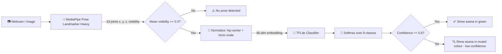
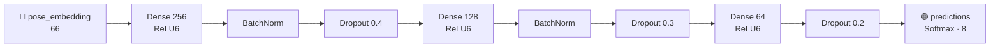
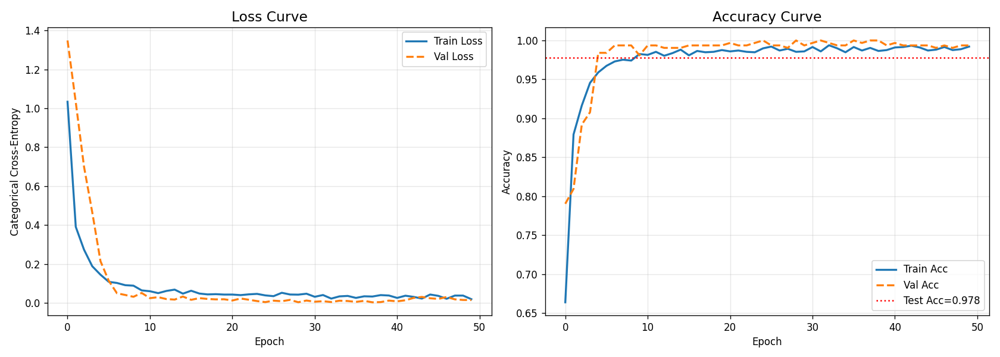
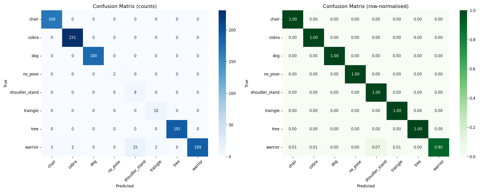
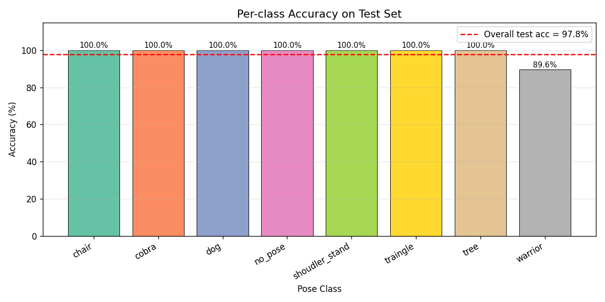
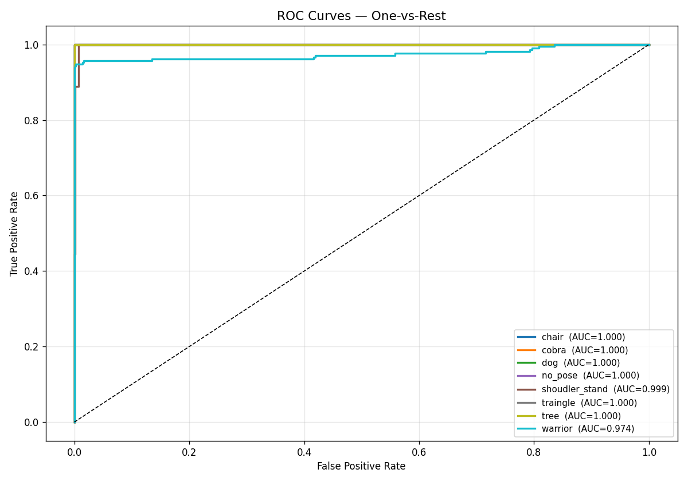
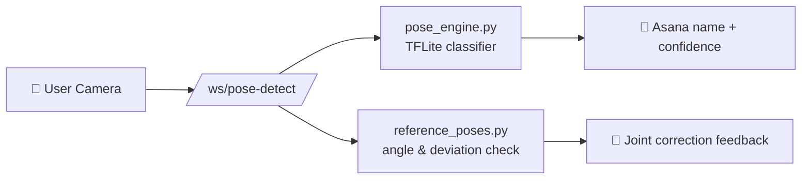

<div align="center">


# 🧘 ASANA-SENSE · ML Core

### *The Computer Vision Brain Behind Real-Time Yoga Posture Guidance*

[](https://www.python.org/)
[](https://www.tensorflow.org/)
[](https://www.tensorflow.org/lite)
[](https://ai.google.dev/edge/mediapipe/solutions/vision/pose_landmarker)
[](https://opencv.org/)
[](https://scikit-learn.org/)
[](https://colab.research.google.com/)


**👁️ See &nbsp;•&nbsp; 🧭 Guide &nbsp;•&nbsp; 📈 Improve**

[✨ Overview](#-overview) • [🧰 Tech Stack](#-technology-stack) • [🔄 Pipeline](#-how-the-ml-pipeline-works) • [🧠 Model](#-model-architecture) • [📊 Results](#-evaluation-results) • [🚀 Quick Start](#-getting-started) • [🔌 Integration](#-backend-integration)

</div>

---

## 📌 Overview

This folder holds **everything machine-learning** for the ASANA-SENSE platform: trained models, landmark datasets, the training notebook, evaluation reports, and a standalone webcam demo.

Instead of feeding raw pixels to a heavy CNN, ASANA-SENSE takes a smarter route:

1. **Skeleton First**: MediaPipe Pose Landmarker (Heavy) extracts **33 body joints** from each frame.
2. **Scale-Invariant Embedding**: Joints are centered on the hip midpoint and scaled by body size, so the result is independent of camera distance and resolution.
3. **Tiny Classifier**: A compact fully-connected network (about **60,000 parameters**) turns the **66-dim embedding** into one of **8 pose classes**.
4. **Edge-Ready**: The classifier is exported to **TFLite (~68 KB)**, small enough to run in real time on a plain CPU.

> [!TIP]
> Because the classifier only sees *joint geometry* (not faces, clothing, or backgrounds), it stays lightweight and generalizes across different people and rooms.

---

## 🧰 Technology Stack

### Where each tool sits in the pipeline

| Stage | What happens | Tool |
|-------|--------------|------|
| 1️⃣ **Capture** | Read webcam frames, mirror, draw skeleton, labels and probability bars | **OpenCV** (`cv2`) |
| 2️⃣ **Pose estimation** | Find 33 body joints in the frame | **MediaPipe Pose Landmarker (Heavy)** |
| 3️⃣ **Normalization** | Turn joints into 66 position- and size-independent numbers | **NumPy** (demo script), **TensorFlow ops** (notebook) |
| 4️⃣ **Classification** | Decide which of the 8 asanas the joints form | **TensorFlow / Keras** neural network |
| 5️⃣ **Real-time inference** | Run the trained classifier on every frame | **TensorFlow Lite Interpreter** |
| 6️⃣ **Evaluation** | Train/validation split, metrics, charts, CSV handling | **scikit-learn, pandas, matplotlib, seaborn** |

### 🦴 MediaPipe Pose Landmarker (the joint finder)
MediaPipe is Google's framework for ready-made vision models. **Pose Landmarker** takes an image and returns **33 landmarks** (face points, shoulders, elbows, wrists, hands, hips, knees, ankles, heels, foot tips). Each has `x`, `y` (0–1 fractions of image width/height), `z` (relative depth) and `visibility` (confidence the joint is visible). It is itself a deep learning model (built on Google's BlazePose design) shipped inside `pose_landmarker_heavy.task`. *Heavy* is its most accurate and slowest size. **It only finds joints; it does not know what a yoga pose is.** Pose recognition is done by this project's own classifier.

### 🧠 TensorFlow & Keras (the deep learning part)
- **TensorFlow** is Google's deep learning library. **Keras** is its high-level API for defining and training networks.
- Here they are used to **build, train, evaluate and save the project's own pose classifier**, a feed-forward neural network (multi-layer perceptron).
- It never sees pixels. Its input is 66 normalized joint numbers and its output is 8 probabilities (one per class). This keeps it small and fast.
- After training, TensorFlow's converter turns the Keras model into a **TFLite** file.

### ⚡ TensorFlow Lite (TFLite)
TFLite is the lightweight runtime for running trained TensorFlow models fast on laptops, servers and phones. The `.tflite` file is converted with default optimizations (dynamic-range quantization: weights stored in a smaller numeric form). `yoga_pose_detector.py` and the backend run it with `tf.lite.Interpreter`. **Training happens once in the notebook; TFLite is what runs live.**

### 🚫 MoveNet: not used in this project
MoveNet is a *different* Google pose-estimation model (17 keypoints, *Lightning* / *Thunder* variants). ASANA-SENSE does **not** use it.

| | **MediaPipe Pose Landmarker** (used here) | **MoveNet** (not used) |
|---|---|---|
| Keypoints | 33 (includes hands, heels, foot tips, face points) | 17 |
| Per-point output | `x, y, z, visibility` | `x, y, score` |
| Variants | Lite / Full / Heavy | Lightning / Thunder |
| Role in ASANA-SENSE | Joint extraction for dataset and live frames | None |

> [!NOTE]
> The extra MediaPipe points (heels, foot index, hands) give the classifier more to separate poses such as `dog`, `tree` and `warrior`.

### 📚 Supporting libraries
**OpenCV**: camera, colour conversion (BGR → RGB), drawing, preview window. **NumPy**: array maths. **pandas**: reading/writing landmark CSVs. **scikit-learn**: stratified split, classification report, confusion matrix, ROC/AUC. **matplotlib / seaborn**: all charts in `evaluation/`.

---

## 🧘 Supported Asana Classes

| # | Class Key | Asana | Sanskrit Name | Train Samples | Test Samples |
|:-:|-----------|-------|---------------|:-------------:|:------------:|
| 0 | `chair` | 🪑 Chair Pose | *Utkatasana* | 389 | 168 |
| 1 | `cobra` | 🐍 Cobra Pose | *Bhujangasana* | 381 | 231 |
| 2 | `dog` | 🐕 Downward Dog | *Adho Mukha Svanasana* | 397 | 180 |
| 3 | `no_pose` | 🚶 Transition / Out of frame | — | 26 | 2 |
| 4 | `shoulder_stand` | 🤸 Shoulder Stand | *Sarvangasana* | 49 | 9 |
| 5 | `triangle` | 📐 Triangle Pose | *Trikonasana* | 45 | 10 |
| 6 | `tree` | 🌳 Tree Pose | *Vrikshasana* | 417 | 192 |
| 7 | `warrior` | ⚔️ Warrior Pose | *Virabhadrasana* | 394 | 211 |
| | | | **Total** | **2,098** | **1,003** |

> [!NOTE]
> Class indices are fixed by the trained model and stored in `models/class_names.txt`. They came from the alphabetical order of the original dataset labels (`shoudler_stand`, `traingle`). See [Known Limitations](#-known-limitations--notes) before retraining with corrected spelling.

---

## 🔄 How the ML Pipeline Works



### 📐 Normalization (the secret sauce)

| Step | What happens | Why it matters |
|------|--------------|----------------|
| 1️⃣ **Center** | Subtract the midpoint of the left and right hip (landmarks 23, 24) from every joint | Position in frame no longer matters |
| 2️⃣ **Measure** | Torso size = distance from shoulder-center (landmarks 11, 12) to hip-center | Gives a body-relative ruler |
| 3️⃣ **Scale** | Divide by `max(torso × 2.5, farthest joint distance)` (floor `1e-6`) | Distance from camera no longer matters |
| 4️⃣ **Flatten** | Keep only `x, y` of 33 joints → **66 features** | Compact input for the classifier |

> [!IMPORTANT]
> The normalization in `scripts/yoga_pose_detector.py` must match the notebook **exactly**. If you change one, change the other, or predictions will silently degrade.

---

## 🧠 Model Architecture



| Setting | Value |
|---------|-------|
| **Model name** | `yoga_pose_classifier` (Keras Functional, ~60K parameters) |
| **Optimizer** | Adam, learning rate `1e-3` |
| **Loss** | Categorical cross-entropy |
| **Batch size / max epochs** | `32` / `200`. Early stopping triggered at epoch 50; best weights from **epoch 25** (validation accuracy 1.000) were restored |
| **Validation split** | 15% of train, stratified, `random_state=42` (about 1,783 train / 315 validation rows) |
| **Callbacks** | `ModelCheckpoint` (best `val_accuracy`), `EarlyStopping` (patience 25, best weights restored), `ReduceLROnPlateau` (factor 0.5, patience 10, min `1e-6`) |
| **Training environment** | Google Colab, T4 GPU, TensorFlow 2.20.0, MediaPipe 1.0.1, Keras 3.13.2 |
| **Local runtime** | Python 3.12 (demo script) |
| **Input / output shape** | `(None, 66)` float32 → `(None, 8)` float32 |
| **Export** | Keras model saved as `.keras` and SavedModel; **TFLite** converted from the Keras model with default optimizations (dynamic-range quantization) |

<details>
<summary><b>📖 Term guide (click to expand)</b></summary>

- **Dense**: every neuron connects to every neuron in the previous layer.
- **ReLU6**: activation that clips values to 0–6; works well with quantized TFLite models.
- **BatchNormalization**: stabilizes and speeds up training.
- **Dropout**: randomly switches off neurons during training to reduce overfitting.
- **Softmax**: turns the 8 outputs into probabilities that sum to 1; the highest is the predicted pose.
- **Precision**: of samples predicted as a class, how many were correct. **Recall**: of real samples of a class, how many were found. **F1**: combined score of both.
- **ROC / AUC**: how well one class is separated from all others (1.0 = perfect).
</details>

---

## 📊 Evaluation Results

> [!NOTE]
> **Evaluation protocol:** `test_landmarks.csv` (1,003 samples) is held out. It is **not** used for training, validation, checkpointing or early stopping. It is used once, after training, for every metric and chart below. The `training_curves.png` validation line comes from the 15% validation split, not from the test set. All metrics are for the Keras model; the quantized TFLite model was not scored separately.

<div align="center">

| 🎯 Test Accuracy | 📉 Test Loss | 📈 Macro AUC | ⚖️ Weighted F1 | 🧪 Test Samples |
|:-:|:-:|:-:|:-:|:-:|
| **97.81%** | **0.2194** | **0.9966** | **0.981** | **1,003** |

</div>

Macro-average over classes: precision **0.898**, recall **0.987**, F1 **0.923**.

### 🏅 Per-Class Report

| Class | Precision | Recall | F1-Score | Support | AUC | F1 Bar |
|-------|:---------:|:------:|:--------:|:-------:|:---:|--------|
| 🪑 chair | 0.982 | 1.000 | 0.991 | 168 | 1.000 | `██████████` |
| 🐍 cobra | 0.991 | 1.000 | 0.996 | 231 | 1.000 | `██████████` |
| 🐕 dog | 1.000 | 1.000 | 1.000 | 180 | 1.000 | `██████████` |
| 🚶 no_pose | 1.000 | 1.000 | 1.000 | 2 | 1.000 | `██████████` |
| 🤸 shoulder_stand | 0.375 | 1.000 | 0.545 | 9 | 0.999 | `█████░░░░░` |
| 📐 triangle | 0.833 | 1.000 | 0.909 | 10 | 1.000 | `█████████░` |
| 🌳 tree | 1.000 | 1.000 | 1.000 | 192 | 1.000 | `██████████` |
| ⚔️ warrior | 1.000 | 0.896 | 0.945 | 211 | 0.974 | `█████████░` |

### 🔍 Where the Errors Come From

Every class is classified perfectly **except `warrior`**. Of 211 warrior test samples, **22 are misclassified**:

| Warrior predicted as | Count |
|----------------------|:-----:|
| 🤸 shoulder_stand | 15 |
| 🪑 chair | 3 |
| 🐍 cobra | 2 |
| 📐 triangle | 2 |
| ⚔️ warrior (correct) | 189 |

These warrior errors explain the weak precision of the small classes: `shoulder_stand` precision is 9 / (9 + 15) = 0.375 and `triangle` precision is 10 / (10 + 2) = 0.833.

> [!WARNING]
> **Read the small-class numbers with care.** `shoulder_stand`, `triangle`, and `no_pose` have only 49, 45, and 26 training images (and 9, 10, 2 test images). Their scores swing a lot from just a few samples. Adding more images for these classes, and more varied `warrior` images, is the most effective next improvement.

### 📈 Visual Analytics

<table>
  <tr>
    <td align="center"><b>📉 Training Curves</b><br/></td>
    <td align="center"><b>🧩 Confusion Matrix</b><br/></td>
  </tr>
  <tr>
    <td align="center"><b>📊 Per-Class Accuracy</b><br/></td>
    <td align="center"><b>📡 ROC Curves (One-vs-Rest)</b><br/></td>
  </tr>
</table>

---

## 🛠️ Directory Structure

```
ml/
├── 📦 models/                          # Trained model artifacts
│   ├── yoga_pose_classifier.tflite       # ⚡ Lightweight classifier used at runtime
│   ├── best_yoga_model.keras/            # Best checkpoint, unpacked Keras 3 archive
│   │   ├── config.json                   #   model architecture
│   │   ├── metadata.json                 #   Keras version and save date
│   │   └── model.weights.h5              #   trained weights
│   ├── best_yoga_model_copy.keras        # Same checkpoint as a single Keras 3 (.keras) archive file
│   ├── pose_landmarker_heavy.task        # 🦴 MediaPipe Pose Landmarker Heavy asset (~30 MB)
│   └── class_names.txt                   # Class label order
│
├── 🗂️ data/                            # Landmark datasets (CSV)
│   ├── train_landmarks.csv               # 2,098 training poses
│   └── test_landmarks.csv                # 1,003 test poses (held out)
│
├── 📓 notebooks/                       # Training & experimentation
│   └── yoga_pose_classifier (1).ipynb    # Colab / Jupyter: extract → normalize → train → evaluate → export
│
├── 🎥 scripts/                         # Standalone demos
│   ├── yoga_pose_detector.py             # Real-time webcam demo (OpenCV + MediaPipe + TFLite)
│   └── class_names.txt                   # Labels used by the demo
│
├── 📊 evaluation/                      # Validation reports & charts (test set)
│   ├── classification_report.csv         # Precision / recall / F1 for all classes
│   ├── confusion_matrix.png
│   ├── per_class_accuracy.png
│   ├── roc_curves.png
│   └── training_curves.png
│
└── 🖼️ assets/
    └── asana_sense_logo.png              # Project logo used in this README
```

### 🗂️ Dataset Format

Each row in the CSVs is **one image** (135 columns in total):

| Column group | Count | Description |
|--------------|:-----:|-------------|
| `filename` | 1 | `<class>/<image file>` of the source image |
| `<JOINT>_x`, `_y`, `_z`, `_vis` | 33 × 4 = **132** | Raw MediaPipe landmarks (`NOSE` … `RIGHT_FOOT_INDEX`) |
| `class_no`, `class_name` | 2 | Numeric and text label |

> [!NOTE]
> The CSVs store **raw** landmarks (`x`, `y` as 0–1 fractions of the image, `z` relative depth, `vis` visibility). Normalization to the 66-dim embedding happens inside the notebook and the detector script. Images where no pose is found (mean visibility below 0.3) were skipped when the CSVs were built: 41 of 2,139 train images and 8 of 1,011 test images.

---

## 🚀 Getting Started

### 1️⃣ Install Dependencies

```bash
# From the repository root
cd ml

# (Recommended) create a virtual environment
python -m venv venv
# Windows:
.\venv\Scripts\activate
# macOS / Linux:
source venv/bin/activate

# Install packages for the demo (tested with Python 3.12)
pip install tensorflow mediapipe opencv-python numpy

# Extra packages only needed to retrain / evaluate in the notebook
pip install pandas scikit-learn matplotlib seaborn tqdm
```

### 2️⃣ Run the Real-Time Webcam Demo 🎥

```bash
python scripts/yoga_pose_detector.py
```

What you get:

- 🦴 A live skeleton overlay on your webcam feed (camera 0, 1280×720, mirrored for natural movement)
- 🎯 The top prediction plus a probability bar for every class. The label is **green at ≥ 60% confidence** and a muted colour below it (the prediction is still shown)
- ⏱️ FPS counter and status banner (`Detected: tree (97.3%)` or `No pose detected — step into frame`)
- ⌨️ Press **`Q`** to quit

> [!TIP]
> Stand far enough back that your **whole body** is visible. A full skeleton gives noticeably more stable predictions.

### 3️⃣ Use the TFLite Model in Your Own Code 🧩

```python
import numpy as np
import tensorflow as tf

interpreter = tf.lite.Interpreter(model_path="models/yoga_pose_classifier.tflite")
interpreter.allocate_tensors()
inp = interpreter.get_input_details()[0]
out = interpreter.get_output_details()[0]

# embedding: (66,) float32, produced by the same normalization as training
interpreter.set_tensor(inp["index"], embedding[np.newaxis, :].astype(np.float32))
interpreter.invoke()
probs = interpreter.get_tensor(out["index"])[0]

classes = [c.strip() for c in open("models/class_names.txt") if c.strip()]
print(classes[int(np.argmax(probs))], float(probs.max()))
```

### 4️⃣ Retrain the Model 🔁

1. Open `notebooks/yoga_pose_classifier (1).ipynb` in **Google Colab** (GPU optional).
2. Upload `yoga_poses.zip` with this layout:
   ```
   yoga_poses/
   ├── train/  chair/  cobra/  dog/  ...
   └── test/   chair/  cobra/  dog/  ...
   ```
3. Run the cells in order. The notebook extracts landmarks, builds the CSVs, normalizes, trains, evaluates, and exports `.keras`, SavedModel, `.tflite`, and `class_names.txt`. The CSVs are read from and written to the notebook's working directory.
4. Download the new files from the Colab session and copy them into `models/`, `data/`, and `evaluation/`.

---

## 🔌 Backend Integration

| Backend module | What it uses from `ml/` | Purpose |
|----------------|------------------------|---------|
| `backend/pose_engine.py` | `models/yoga_pose_classifier.tflite` (with root fallback) | Real-time pose classification |
| `backend/reference_poses.py` | `data/train_landmarks.csv` | Computes mean / variance reference vectors per asana to measure **joint deviations** |
| WebSocket `/ws/pose-detect` | Both of the above | Streams live classification and posture feedback to the app |



---

## 🎨 Brand Palette

Taken straight from the ASANA-SENSE logo:

| Color | Approx. Hex | Usage |
|-------|:-----------:|-------|
| 🔵 **Deep Navy** | `#0B2A5B` | Wordmark, skeleton silhouette, primary text |
| 🟦 **Vision Blue** | `#1E6FD9` | AI / landmark nodes, links, badges |
| 🟢 **Balance Green** | `#2EA043` | "SENSE", spine line, correct-posture states |
| ⚪ **Calm White** | `#F8FAFC` | Backgrounds and clean space |

---

## ⚠️ Known Limitations & Notes

> [!CAUTION]
> - **Label spelling:** the CSVs, `classification_report.csv`, the evaluation images, and the hard-coded list inside `yoga_pose_detector.py` use the spellings `shoudler_stand` and `traingle`, while `class_names.txt` uses `shoulder_stand` and `triangle`. The order is identical, so predictions are unaffected today.
> - **Retraining trap:** alphabetical sorting puts `traingle` before `tree`, but corrected `triangle` sorts **after** `tree`. If you fix the spelling in the data and re-run the notebook, class indices 5 and 6 swap. Retrain and use the newly exported `class_names.txt` everywhere, or the labels will be mixed up.
> - **Class imbalance:** `no_pose`, `shoulder_stand`, and `triangle` are heavily under-represented compared with the other classes.
> - **Warrior confusion:** about 10% of warrior test samples are misclassified (mostly as `shoulder_stand`).
> - **TFLite not scored separately:** all reported metrics come from the Keras model, not the quantized TFLite model used at runtime.
> - **No aspect-ratio correction:** landmark `x`, `y` are fractions of image width and height, so training images and live 1280×720 frames of different shapes can shift accuracy slightly. Test live.
> - **2D only:** depth (`z`) and visibility are not given to the classifier.
> - **Display-only threshold:** `CONF_THRESHOLD` (0.6) only changes label colour; it does not hide low-confidence predictions.
> - **Single person:** the landmarker is configured for `num_poses=1`.
> - **Model size:** `pose_landmarker_heavy.task` is about 30 MB. If you push to GitHub, consider [Git LFS](https://git-lfs.com/) or downloading it from MediaPipe instead.

---

## 🙏 Acknowledgments

Built with care for safer, smarter yoga practice. Thanks to the open-source communities behind **MediaPipe**, **TensorFlow / Keras**, **OpenCV**, and **scikit-learn**.

<div align="center">

**ASANA-SENSE** • *See · Guide · Improve* • AI-Powered Computer Vision Yoga Guide • 2026

</div>
